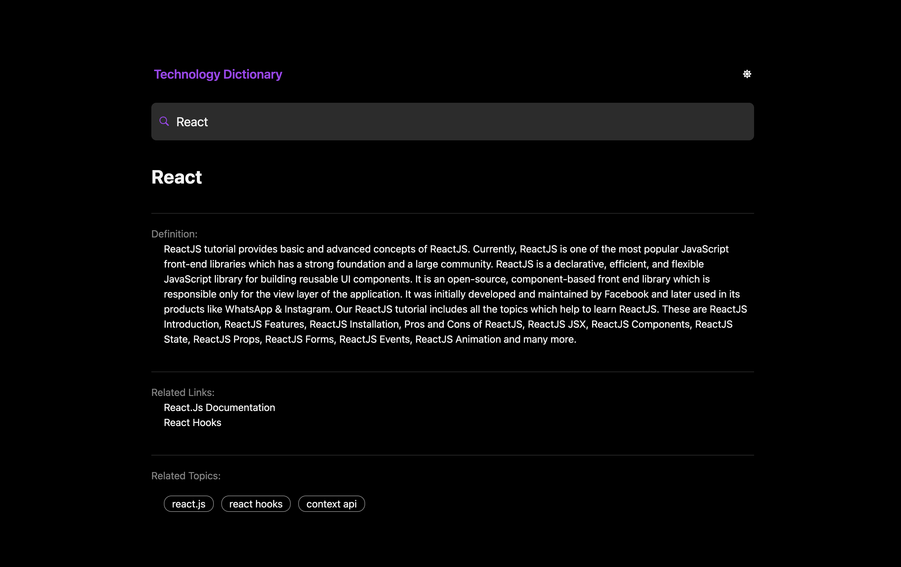
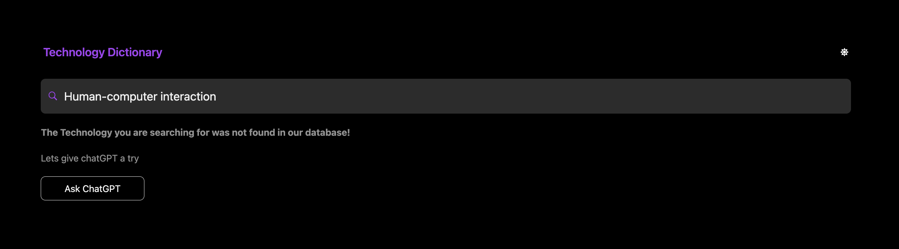

## About this repository

- This is a knowledge dictionary implemented using : Next.JS, GraphQL, MongoDB, Apollo, Tailwind CSS, TypeScript
- You can find different topics with the definition, maximum 10 related links and 10 related topics in the dictionary
- If the word is not found in my database, it will suggest you to find the definition using chatGPT and if so loades the definition,related links and related topics using openAI
- if you click on any topic the dictionary will try to find it
- It supports both dark mode and light mode
- It supports all screen sizes

## How to get it work

- run 'yarn' command to install all the dependencies
- run 'yarn dev' to start the development environment on 'localhost:3000'
- you can also go to localhost:3000/api/graphql to se apollo graphQL server
- you must import your own API_KEY for chatgpt to get the feature work

## More to know

- Typescript is configured in tsconfig.json file
- TailwindCSS is configured in tailwind.config.js
- you can define your own MongoDB instance in https://cloud.mongodb.com/ in case you need to have your own database

## References

- <a href='https://nextjs.org/docs' target='_blank'> Next.JS documentation </a>
- <a href='https://nextjs.org/docs' target='_blank'> TypeScript documentation </a>
- <a href='https://tailwindcss.com/'>Tailwind CSS documentation</a>
- <a href='https://www.mongodb.com/'>MongoDB documentation</a>
- <a href='https://www.apollographql.com/docs/'>Apollo documentation</a>
- <a href='https://platform.openai.com/docs/guides/gpt'>ChatGPT OpenAI documentation</a>
